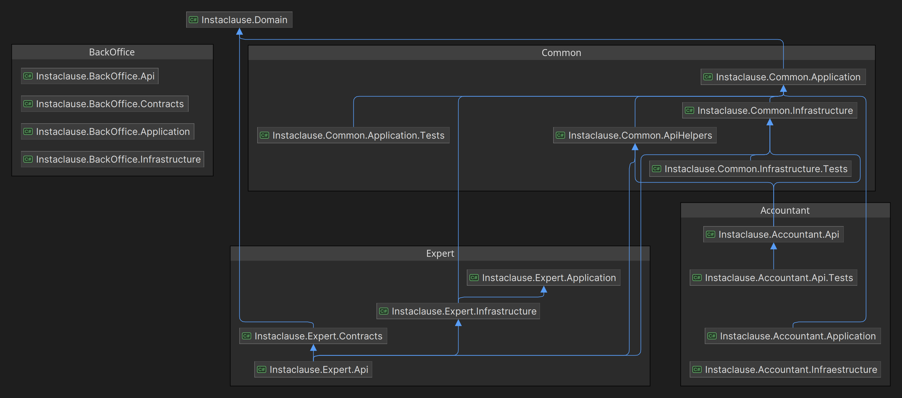

# Overview
Doidera

## Programming Principles
- **Clean Architecture**
- **Domain Driven Design**
- **CQRS (Under evaluation)**

# Solution

## Instaclause.Domain
This project contains the domain entities and the domain services. It is responsible for the domain logic of the application.

## Expert

### Instaclause.Expert.Api
This project is the main entry point for the Expert API. It contains the controllers and the configuration for the API.

### Instaclause.Expert.Application
This project contains the application services and the domain services. It is responsible for the business logic of the application.

### Instaclause.Expert.Infrastructure
This project contains the data access layer and the infrastructure services. It is responsible for the data access and the infrastructure services.

## Accountant

### Instaclause.Accountant.Api

### Instaclause.Accountant.Application

### Instaclause.Accountant.Infrastructure

## BackOffice

### Instaclause.BackOffice.Api

### Instaclause.BackOffice.Application

### Instaclause.BackOffice.Infrastructure

## Common

### Instaclause.Common.ApiHelpers

### Instaclause.Common.Application

### Instaclause.Common.Infrastructure

# Nuget Packages
- **ErrorOr (1.10.0)**
- **Scriban (5.9.1)**
- **EntityFrameworkCore (8.0.2)**
- **Npsql (8.0.2)**
- **Swashbuckle (6.4.0)**
- **StyleCop.Analyzers (1.2.0)**
- **MsTest (3.2.2)**
